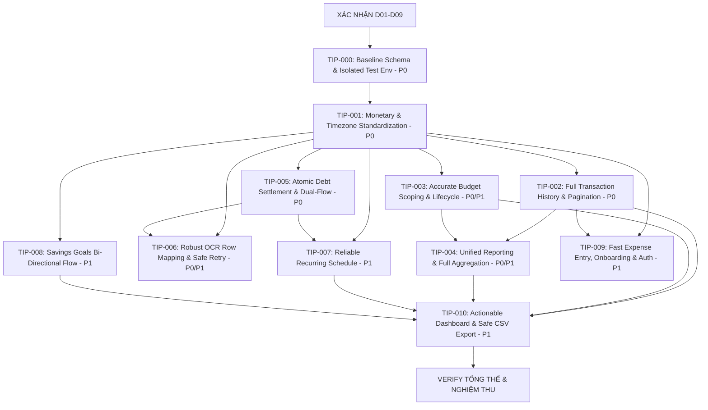

# TASK GRAPH & DEPENDENCY MAP — Quản lý thu chi (VibeCode Kit v6.1)
Ngày lập: 07/09/2026
Người lập: THẦU (Contractor)

---

## 1. BIỂU ĐỒ PHỤ THUỘC (DEPENDENCY GRAPH)

---

## 2. CÁC ĐỢT THI CÔNG (EXECUTION WAVES)

### ĐỢT 0: Chuẩn bị Nền tảng (Foundation Wave)
- **TIP-000 (V1-00):** Chuẩn hóa Baseline Migration và Môi trường Test Cô lập
  - *Mục tiêu:* Gom thống nhất các file migrations từ cả 2 thư mục; bổ sung migration định nghĩa bảng `global_categories` và RPC `mark_debt_paid`; cô lập hoàn toàn test suite unit/component khỏi database remote demo; đảm bảo lệnh test mặc định không ghi Supabase production/demo.
  - *Priority:* P0 (Hỗ trợ)
  - *Dependencies:* Phê duyệt D09.

### ĐỢT 1: Chuẩn hóa Lõi Số liệu & Lịch sử (Core Data Wave)
- **TIP-001 (V1-01):** Chuẩn hóa Hợp đồng Tiền tệ, Múi giờ UTC+7 & Số dư Thẻ tín dụng
  - *Mục tiêu:* Helper tạo khoảng thời gian theo timezone; sửa logic `calculate_net_worth` để thẻ tín dụng không làm tăng tài sản; sửa trục Y và tooltip đồng bộ đơn vị; cảnh báo VND-only cho Cài đặt.
  - *Priority:* P0 (Khắc phục F01, F02, F07, F23)
  - *Dependencies:* TIP-000, D01, D02.
- **TIP-002 (V1-02):** Truy cập Đầy đủ Lịch sử Giao dịch & Phân trang Server
  - *Mục tiêu:* Phân trang server-side vượt mốc 200 giao dịch; tìm kiếm theo nội dung/khoảng ngày; hiển thị 2 phía của transfer; bộ lọc xem giao dịch đã hủy (`voided`).
  - *Priority:* P0 (Khắc phục F05)
  - *Dependencies:* TIP-001.

### ĐỢT 2: Công nợ Nguyên tử, Ngân sách & Báo cáo Đúng bản chất (Integrity Wave)
- **TIP-005 (V1-05):** Công nợ Nguyên tử & Phân tách Tiêu dùng
  - *Mục tiêu:* Tạo RPC thanh toán nguyên tử `settle_debt_payment` có khóa chống race condition và idempotency; tách biệt nợ cũ vs mới; tách dòng tiền thu nợ/trả nợ khỏi thu nhập/chi tiêu tiêu dùng; thống nhất form thanh toán cho cả `lend` và `borrow`.
  - *Priority:* P0 (Khắc phục F08, F09, F10)
  - *Dependencies:* TIP-000, TIP-001, D02.
- **TIP-003 (V1-03):** Ngân sách Đúng phạm vi & Đầy đủ Vòng đời
  - *Mục tiêu:* Chọn "Toàn bộ" hoặc danh mục cụ thể (mở rộng cây cha/con không đếm trùng); xử lý lỗi hiển thị riêng biệt; bổ sung sửa/dừng/lưu trữ; tính đúng ngày bao gồm của kỳ.
  - *Priority:* P0/P1 (Khắc phục F03, F04, F17)
  - *Dependencies:* TIP-001, D03.
- **TIP-004 (V1-04):** Báo cáo Chi tiêu Toàn diện & Đồng bộ Thời gian
  - *Mục tiêu:* Tổng hợp dữ liệu từ DB (không sample 500 dòng); hiển thị nhóm Chưa phân loại và Các danh mục khác; đồng bộ bộ lọc kỳ cho toàn bộ biểu đồ và heatmap.
  - *Priority:* P0/P1 (Khắc phục F06, F20)
  - *Dependencies:* TIP-001, TIP-002, D03.

### ĐỢT 3: Xử lý OCR Thông minh & An toàn (Safe OCR Wave)
- **TIP-006 (V1-06):** OCR Ánh xạ Hàng Ổn định, Retry Từng Dòng & Bảo mật Khóa
  - *Mục tiêu:* Gán `client_row_id` ổn định cho từng dòng quét; lưu nguyên tử mỗi dòng; retry độc lập các dòng lỗi mà không lưu trùng dòng đã thành công; xóa bỏ logic tự nhân 100 theo ngưỡng; bảo vệ API Key phía backend.
  - *Priority:* P0/P1 (Khắc phục F11, F12, F13, F14)
  - *Dependencies:* TIP-000, TIP-001, TIP-005, D07, D09.

### ĐỢT 4: Vận hành Thường nhật & Trải nghiệm Người dùng (Daily Experience Wave)
- **TIP-007 (V1-07):** Định kỳ Vận hành Đúng lịch theo Ngày trong Tháng
  - *Mục tiêu:* Xử lý `day_of_month` đúng lịch (kể cả ngày 31 tháng ngắn); preview 3 kỳ tới; sinh trạng thái "Đến hạn / Chờ xác nhận" trước khi ghi sổ chính thức.
  - *Priority:* P1 (Khắc phục F15)
  - *Dependencies:* TIP-001, TIP-005, D04.
- **TIP-008 (V1-08):** Mục tiêu Tích lũy Rõ ràng & Thao tác Hai chiều
  - *Mục tiêu:* Cung cấp 2 nút Thêm/Rút tiền với số tiền dương; kiểm tra rút không vượt quá số dư mục tiêu; không tạo chi phí tiêu dùng giả.
  - *Priority:* P1 (Khắc phục F16)
  - *Dependencies:* TIP-001, D05.
- **TIP-009 (V1-09):** Onboarding Liền mạch, Quản trị Tài khoản & Ghi nhanh
  - *Mục tiêu:* Onboarding ngắn 2-3 bước; route Quên/Đặt lại mật khẩu; CTA mở thẳng form chi; nhớ ví gần nhất; cảnh báo khi đóng form có dữ liệu chưa lưu; tách ẩn ví vs đóng ví.
  - *Priority:* P1 (Khắc phục F18, F19, F22, F24)
  - *Dependencies:* TIP-001, TIP-002, D06, D08.

### ĐỢT 5: Dashboard Thông minh, Xuất Dữ liệu & Nghiệm thu Tổng thể (Final Wave)
- **TIP-010 (V1-10):** Dashboard Hành động, Xuất CSV An toàn & Hoàn thiện
  - *Mục tiêu:* Đổi nhãn "Chênh lệch thu–chi"; danh sách 3 việc cần chú ý; đồng bộ nhãn giao dịch gần đây; chức năng xuất toàn bộ giao dịch ra CSV chống formula injection.
  - *Priority:* P1 (Khắc phục F21, F24, F27)
  - *Dependencies:* TIP-002, TIP-003, TIP-004, TIP-007, TIP-008, D08.
- **FINAL VERIFY:** Chạy toàn bộ kiểm thử QA-01 đến QA-17, kiểm tra build/typecheck và lập `FINAL_VERIFY_REPORT.md`.
